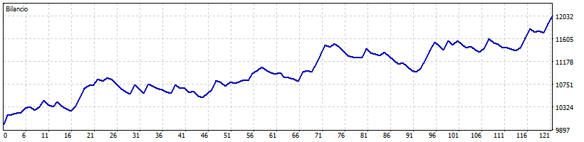

# AI-Enhanced High-Frequency Trading – Hybrid System with Predictive Modeling

**AI-Enhanced HFT** is an advanced trading system that combines traditional rule-based strategies with modern AI-driven forecasting to improve high-frequency trading (HFT) performance in the Forex market. Designed for deployment within MetaTrader 5, this hybrid Expert Advisor (EA) leverages both technical indicators and machine learning insights to optimize trade execution.

The core of the system is a trend-following strategy based on exponential moving average (EMA) crossovers, validated through the Average Directional Index (ADX) and volume confirmation. It includes a sophisticated exit mechanism based on ADX differential analysis, which allows for timely exits during weakening trends.

A key innovation lies in the integration of predictive modules using machine learning (Random Forest, XGBoost) and deep learning (LSTM) models. These models are trained on higher timeframe data (H1) to forecast short-term price direction, and their predictions are incorporated in real time via a TCP socket connection. The EA adjusts trade sizing dynamically based on the alignment between technical signals and AI-generated forecasts.

The framework supports both backtesting and live trading, enabling a robust comparison of model performance across multiple assets and timeframes. Although market-agnostic by design, the system has shown particular effectiveness on selected symbol-timeframe combinations. Extensive evaluations demonstrate enhanced profitability and improved risk-adjusted returns when AI forecasting is employed.

---

## 🌐 Project Overview

This project focuses on the design and implementation of a hybrid trading Expert Advisor (EA) that merges deterministic logic with AI-based predictive modeling to enhance decision-making in high-frequency Forex trading.

At its core, the EA employs a trend-following strategy based on exponential moving average (EMA) crossovers to identify potential trade entries. These signals are validated using two additional filters: the Average Directional Index (ADX), which confirms trend strength, and volume-based analysis to reinforce signal credibility. The exit mechanism is handled through a differential analysis of the ADX, enabling early exit from weakening trends to protect gains and reduce drawdowns.

The innovative aspect of the system lies in the integration of machine learning and deep learning models—specifically Random Forest, XGBoost, and LSTM—trained on higher timeframe (H1) market data. These models generate directional price forecasts that are fed to the EA in real time through a TCP socket connection. During backtesting, the same forecasts can be read from pre-generated CSV files.

A key design feature is the dynamic lot sizing mechanism: trade volume is scaled based on the degree of agreement between technical signals and AI predictions, allowing for more aggressive or conservative positioning depending on confidence levels.

The system is fully compatible with both backtesting and live trading environments, offering flexibility and robustness. Although the strategy is market-agnostic, testing has shown it performs particularly well on specific asset and timeframe combinations, such as XAGUSD on M12.

---

## 🧠 Methodology & Implementation

This project was developed in multiple structured phases, each aimed at incrementally improving both the logic and the performance of the trading system. Below is an overview of the key stages and techniques implemented:

### 1. Baseline Strategy (Rule-Based System)

The foundation of the system is a deterministic Expert Advisor (EA) built in MQL5. It uses well-known technical indicators to identify entry and exit opportunities:
- **EMA Crossovers**: A long position is triggered when the fast EMA (7) crosses above the slow EMA (21); a short position occurs when it crosses below.
- **ADX Filter**: A trend strength validation filter is applied using ADX (14). Trades are allowed only when the ADX exceeds a defined threshold (initially 30).
- **Volume Filter (iVolume)**: Ensures that trades are taken only in periods of sufficient market activity. The current candle’s volume must be higher than the previous one.
- **Fixed SL/TP**: Each trade has a stop loss of 100 pips and a take profit of 300 pips, ensuring a favorable risk-reward ratio.

#### Dynamic Exit Logic (ADX Differential)
In addition to SL/TP, an intelligent early exit mechanism was developed:
- **Forced Exit**: If 3 out of the last 5 ADX variations (ΔADX) are negative, the trend is weakening. The trade is closed even if ADX > 30.
- **Conservative Exit**: If ADX drops below 30 but remains above 25 and volume doesn’t increase, the position is closed to avoid weak trends.

Initial backtests across 24 symbols and various timeframes showed solid performance even without AI support.

---

### 2. AI Integration

AI was introduced not to replace the rule-based logic, but to support it through predictive confirmation:
- **Agreement → Larger Lot**
- **Disagreement → Smaller Lot**

The idea is to modulate exposure, improving the risk-return profile. Real-time communication is handled via **TCP socket** between the EA and a Python microservice. During backtests, predictions are read from a **CSV file**.

---

### 3. AI Models Used

Three supervised models were implemented and trained to predict price direction (up/down):
- **Random Forest**
- **XGBoost**
- **LSTM (Long Short-Term Memory)**

These models use features based on historical prices, volumes, and indicators. Training was done using higher timeframe (H1) data.

---

### 4. Phase 1 – Pre-Optimization Testing

Initial tests with standard parameters (EMA 7/21, ADX 30) showed:
- AI had positive but limited impact
- Some configurations performed inconsistently

---

### 5. Phase 2 – Strategy Optimization

The system was optimized using MetaTrader’s strategy tester:
- **EMA Adjusted to 6/24** for better reactivity
- **ADX Threshold lowered to 22**
- **Simplified Exit Rule**: Conservative exit now triggers if ADX < 25, removing the previous ADX range condition

Post-optimization, backtests were repeated with and without AI support across all three models.

---

### 📈 Sample Equity Curve

Below is a representative equity curve obtained after strategy optimization using the **XGBoost** model on **XAGUSD (M12)**.  
The strategy shows a consistent upward trend with controlled drawdowns.



### 6. Post-Optimization Results

- **XGBoost** was the top performer:
  - Highest net profit
  - Profit Factor > 1.6
  - Sharpe Ratio > 9
  - Controlled drawdown (~563 USD)

- **Random Forest** delivered stable returns with slightly lower profit but good consistency

- **LSTM** underperformed:
  - Negative net profit
  - High drawdown
  - Likely affected by noise and non-stationarity in financial data

---

### 7. Final Considerations

AI integration—when done selectively—can significantly enhance a solid technical strategy. The lot modulation approach preserved trade frequency while increasing system flexibility. Tree-based models (RF/XGBoost) were more robust in handling noisy financial data than deep learning alternatives like LSTM.

The use of **iVolume** as a filter helped prevent false signals in low liquidity. iAD was deliberately excluded to avoid redundancy since EMA and ADX already covered trend direction.

In conclusion, the project successfully demonstrated how AI can intelligently support, rather than replace, traditional trading logic in high-frequency environments.

## 🛠️ Technologies & Tools

- **Languages**: Python, MQL5
- **Libraries**: Scikit-learn, XGBoost, TensorFlow/Keras, pandas
- **Platform**: MetaTrader 5
- **Data Handling**: CSV export/import, socket communication
- **Models**: Random Forest, XGBoost, LSTM
- **Backtesting Engine**: MetaTrader 5 Strategy Tester

---

## 📁 Repository Structure

```
AI_HFT_Hybrid/
├── Hybrid_EA.mq5                 → Main Expert Advisor file (MQL5)
├── Export_H1_Data.mq5            → Export script for H1 data from MetaTrader
├── socket_ai.py                  → Python socket server for real-time AI forecasts
├── XAGUSD_H1_data.csv            → Exported dataset used for model training
├── README.md                     → Project documentation (this file)

├── backtest_ema6_24/             → Backtest results with EMA 6/24 configuration
│   ├── lstm/
│   ├── baseline_only/
│   ├── random_forest/
│   └── xgboost/

├── backtest_adx22/               → Backtest results with ADX threshold at 22
│   ├── lstm/
│   ├── baseline_only/
│   ├── random_forest/
│   └── xgboost/

├── backtest_iAD_filter/          → Backtest results using iAD filter (deprecated)
│   ├── lstm/
│   ├── baseline_only/
│   ├── random_forest/
│   └── xgboost/

├── backtest_default_params/      → Results before applying parameter optimization
│   ├── lstm/
│   ├── baseline_only/
│   ├── random_forest/
│   └── xgboost/

├── model_lstm/                   → LSTM model files and related scripts
│   ├── train_lstm.ipynb
│   ├── lstm_trend_model.h5
│   ├── forecast_lstm.csv
│   ├── correlation_heatmap.png
│   ├── lstm_confusion_matrix.png
│   ├── lstm_ready_dataset.csv
│   ├── price_ema_plot.png
│   ├── scaler_lstm.save
│   └── forecast_lstm.py     

├── model_rf/                      → Random Forest model files and scripts
│   ├── train_random_forest.ipynb
│   ├── random_forest_trend_model.pkl
│   ├── forecast_RF.csv
│   ├── correlation_heatmap.png
│   ├── price_ema_plot.png
│   ├── randomforest_ready_dataset.csv
│   ├── rf_confusion_matrix.png
│   ├── scaler_randomforest.save
│   └── forecast_RF.py      

├── model_xgboost/                  → XGBoost model files and scripts
│   ├── train_xgboost.ipynb
│   ├── xgboost_trend_model.pkl
│   ├── forecast_XGBoost.csv
│   ├── correlation_heatmap.png
│   ├── price_ema_plot.png
│   ├── scaler_xgboost.save
│   ├── forecast_xgboost.py
│   ├── xgboost_ready_dataset.csv
│   └── xgb_confusion_matrix.png
```
---

## 🚀 How to Use

1. Clone the repository:
   ```bash
   git clone https://github.com/Marco210210/AI-Enhanced-HFT
   ```

2. Open **MetaTrader 5** and load the Expert Advisor:
   - Navigate to the `Hybrid_EA.mq5` file.
   - Compile it within the MetaEditor.
   - Attach the compiled EA to a chart (e.g., XAGUSD on M12 timeframe).

3. To run the model in **live trading mode**:
   - Execute the Python socket server that serves AI predictions:
     ```bash
     python socket_ai.py
     ```
   - By default, the script uses the **XGBoost** model, which provided the best overall results.

4. To run **backtests**:
   - Use the MetaTrader 5 Strategy Tester.
   - The EA will automatically read AI predictions from pre-generated CSV files (e.g., `forecast_XGBoost.csv`).
- The forecast CSV files must be placed in the MetaTrader 5 file directory:
     ```
     ...\MetaQuotes\Terminal\Common\Files
     ```
     This allows the EA to access the predictions during backtesting.

---

## 📄 Documentation

- 📘 [Final Project Paper (PDF)](docs/HFT_Hybrid_AI_Paper.pdf)

---

## 👥 Author

- **Marco Di Maio** – [GitHub Profile](https://github.com/Marco210210) | Data Science Field

---


## 📄 License

This project is licensed under the [CC BY-NC-SA 4.0 License](https://creativecommons.org/licenses/by-nc-sa/4.0/)  
[](https://creativecommons.org/licenses/by-nc-sa/4.0/)  

You may share and adapt this work for non-commercial purposes only, **as long as you give appropriate credit** and **distribute your contributions under the same license**.  
For commercial use, **explicit permission from the authors is required**.
